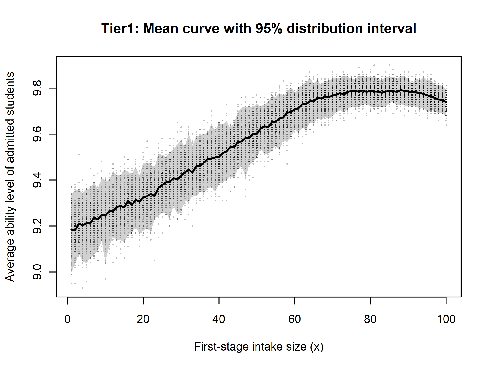
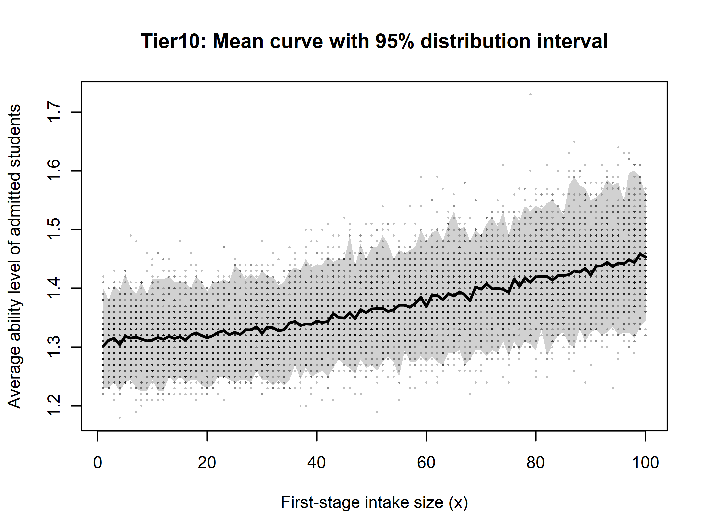

## Simulation

In this simulation, our goal is to construct a probability-based representation of students’ exam performance and use it as the foundation for subsequent sampling and analysis.

We begin by loading the required packages for parallel computation and reproducible simulations. We then source a set of custom functions hosted on GitHub, including a utility for constructing the probability matrix. The resulting object, `prob_mat`, characterizes the distribution of **student ability levels (Tier1–Tier10)** across **exam outcomes (1–10)** and serves as the core input for the simulation study.


```r
library(doParallel)
library(foreach)
library(doRNG)

source(
  "https://raw.githubusercontent.com/Zhiyu-Wei/Institutional-Research-Analysis/main/function.R"
)

prob_mat <- build_prob_mat()
```
### Probability Matrix (prob_mat)

Rows correspond to student ability levels (Tier1–Tier10), columns correspond to exam outcomes (10–1), and each entry represents the probability that a student at a given ability level attains a particular exam outcome. Each row therefore forms a valid probability distribution over exam outcomes.

| Student (Tier) | 10     | 9     | 8     | 7     | 6     | 5     | 4     | 3     | 2     | 1    |
|--------|--------|--------|--------|--------|--------|--------|--------|--------|--------|--------|
| Tier1 | 0.7202 | 0.2138 | 0.0660 | 0.0000 | 0.0000 | 0.0000 | 0.0000 | 0.0000 | 0.0000 | 0.0000 |
| Tier2 | 0.2378 | 0.5357 | 0.1974 | 0.0290 | 0.0001 | 0.0000 | 0.0000 | 0.0000 | 0.0000 | 0.0000 |
| Tier3 | 0.0143 | 0.2446 | 0.5509 | 0.1349 | 0.0553 | 0.0000 | 0.0000 | 0.0000 | 0.0000 | 0.0000 |
| Tier4 | 0.0014 | 0.0134 | 0.2293 | 0.5164 | 0.2240 | 0.0156 | 0.0000 | 0.0000 | 0.0000 | 0.0000 |
| Tier5 | 0.0000 | 0.0016 | 0.0788 | 0.3156 | 0.5863 | 0.0177 | 0.0000 | 0.0000 | 0.0000 | 0.0000 |
| Tier6 | 0.0000 | 0.0009 | 0.0475 | 0.1568 | 0.2468 | 0.5283 | 0.0107 | 0.0089 | 0.0001 | 0.0000 |
| Tier7 | 0.0000 | 0.0000 | 0.0010 | 0.0097 | 0.0503 | 0.3743 | 0.5533 | 0.0113 | 0.0001 | 0.0000 |
| Tier8 | 0.0000 | 0.0000 | 0.0009 | 0.0092 | 0.0476 | 0.1571 | 0.2472 | 0.5291 | 0.0089 | 0.0000 |
| Tier9 | 0.0000 | 0.0000 | 0.0001 | 0.0011 | 0.0072 | 0.0327 | 0.1101 | 0.2872 | 0.5469 | 0.0148 |
| Tier10| 0.0000 | 0.0000 | 0.0000 | 0.0002 | 0.0012 | 0.0064 | 0.0258 | 0.0857 | 0.2475 | 0.6331 |

For example, the first row corresponds to Tier-1 students. A Tier-1 student has a probability of 0.7202 of scoring 10 points (the maximum score) on the exam, and a probability of 0.2138 of scoring 9 points, indicating that high-ability students are strongly concentrated at the upper end of the score distribution.


Next, we conduct 100 simulation runs to evaluate the average ability level of students admitted by the school after two rounds of examinations. The detailed exam and admission rules used in the simulation are described in `README.md`.

In principle, the simulation output is a 10 × 100 table, where each row corresponds to a school tier (Tier1–Tier10) and each column corresponds to a first-stage intake size x. For clarity of presentation, we restrict attention to a 10 × 10 subset with x = 10, 20, 30, 40, 50, 60, 70, 80, 90, and 100.


```r
n_cores <- parallel::detectCores() - 4
cl <- makeCluster(n_cores)
registerDoParallel(cl)

set.seed(20251223)

Nsim <- 100

res_list <- foreach(wf = 1:10,
                    .export = c("F_fast_draws", "prob_mat"),
                    .inorder = TRUE) %dorng% {
                      
                      mat <- sapply(1:100, function(xx) {
                        F_fast_draws(x = xx, whichF = wf, n_rep = Nsim)
                      })
                      
                      list(
                        whichF = wf,
                        draws_mat = mat,
                        curve_mean = colMeans(mat)
                      )
}
stopCluster(cl)

out_mat <- do.call(rbind, lapply(res_list, `[[`, "curve_mean"))
rownames(out_mat) <- paste0("F", 1:10)
colnames(out_mat) <- 1:100
out_mat
```
| School (Tier) | x=10   | x=20   | x=30   | x=40   | x=50   | x=60   | x=70   | x=80   | x=90   | x=100  |
|--------------|--------|--------|--------|--------|--------|--------|--------|--------|--------|--------|
| Tier1  | 9.2458 | 9.3257 | 9.4196 | 9.5010 | 9.6010 | 9.7080 | 9.7673 | 9.7885 | 9.7857 | 9.7382 |
| Tier2  | 8.3344 | 8.3731 | 8.4555 | 8.5339 | 8.6113 | 8.7333 | 8.8350 | 8.9674 | 9.0505 | 9.0890 |
| Tier3  | 7.4590 | 7.5044 | 7.5507 | 7.6566 | 7.7139 | 7.8084 | 7.9003 | 7.9843 | 8.0982 | 8.2040 |
| Tier4  | 6.6895 | 6.7490 | 6.7855 | 6.8245 | 6.8819 | 6.9448 | 7.0084 | 7.0678 | 7.1184 | 7.2242 |
| Tier5  | 5.4851 | 5.5223 | 5.5720 | 5.5941 | 5.6841 | 5.7953 | 5.8986 | 6.0461 | 6.1791 | 6.2852 |
| Tier6  | 4.7922 | 4.8399 | 4.8904 | 4.9262 | 4.9638 | 5.0463 | 5.0938 | 5.1581 | 5.2340 | 5.2853 |
| Tier7  | 4.1365 | 4.1425 | 4.1590 | 4.1606 | 4.1557 | 4.1598 | 4.1785 | 4.1716 | 4.1885 | 4.2282 |
| Tier8  | 3.0667 | 3.0780 | 3.1054 | 3.1312 | 3.1670 | 3.2073 | 3.2764 | 3.3156 | 3.3837 | 3.3868 |
| Tier9  | 2.1002 | 2.1268 | 2.1379 | 2.1614 | 2.1848 | 2.2244 | 2.2496 | 2.2683 | 2.3059 | 2.3661 |
| Tier10 | 1.3121 | 1.3158 | 1.3233 | 1.3445 | 1.3651 | 1.3692 | 1.3986 | 1.4194 | 1.4226 | 1.4536 |


The figure below illustrates the relationship between the first-stage intake size and the average ability level of admitted students across school tiers; since no legend is shown, the curves from top to bottom correspond to Tier1 through Tier10, respectively.

```r
x <- 1:100
matplot(
    x, t(out_mat),
    type = "l", lty = 1, lwd = 2,
    xlab = "First-stage intake size (x)",
    ylab = "Average ability level of admitted students",
    main = "School tiers (Tier1–Tier10): average admitted ability vs. intake size x"
  )
```

<p align="center">
  
</p>

For the Tier1 school, the average admitted ability exhibits a non-monotonic pattern, reaching its maximum when the first-stage intake size lies approximately between x = 60 and 80, after which it slightly declines. In contrast, schools in the middle tiers display a generally increasing trend, with the average admitted ability rising steadily as x increases. For the lowest-tier schools, however, the average ability level appears largely insensitive to changes in x, remaining relatively flat across different intake sizes.

Having summarized the overall patterns from the combined plot, we now zoom in on individual schools by plotting them separately. These school-specific figures provide a clearer view of the relationship between the first-stage intake size x and the average admitted ability level. For each selected school, we also include the corresponding 95% distribution interval to reflect the variability across simulation runs.

<p align="center">
  
</p>

<p align="center">
  
</p>

<p align="center">
  
</p>

From the school-specific plots, we can see more clearly that the Tier1 school achieves its highest average admitted ability around x ≈ 80. For both Tier3 and Tier10, the average admitted ability increases as x grows; the difference is that the change is much smaller for Tier10 (i.e., the curve is flatter).

